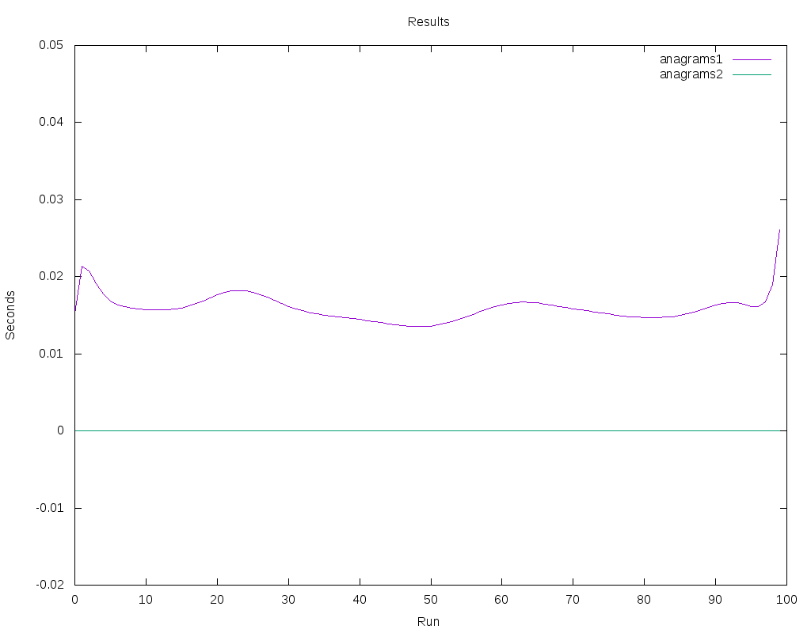
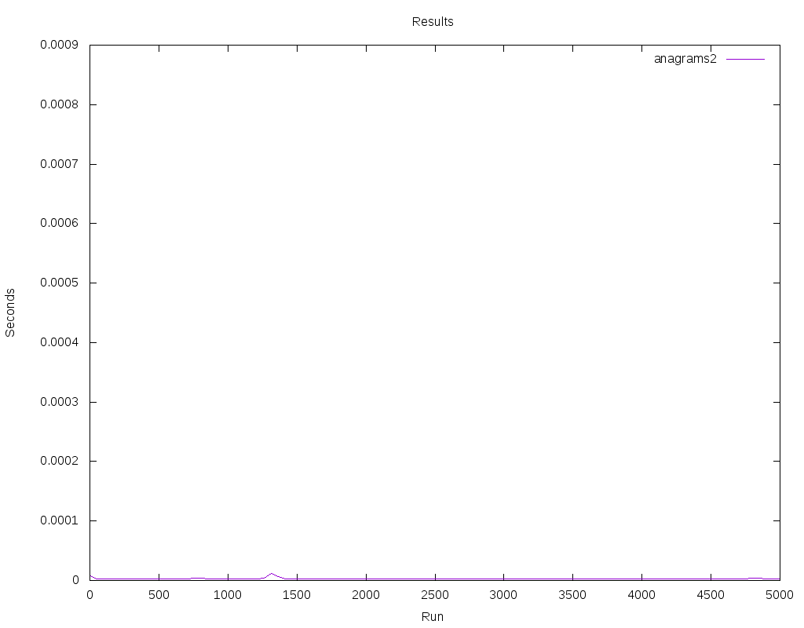

Anagrams
========

The problem
------------

Given a words.txt file containing a newline-delimited list of dictionary
words, please implement the Anagrams class so that the get_anagrams() method
returns all anagrams from words.txt for a given word.

**Bonus requirements:**

  - Optimise the code for fast retrieval
  - Write more tests
  - Thread safe implementation

General approach
----------------

*"An anagram is direct word switch or word play, the result of rearranging
the letters of a word or phrase to produce a new word or phrase, using
all the original letters exactly once"* ( source: wikipedia )

That means that in order to get all the anagrams for a given word, we don't
need to compare the words their selves but their ordered representation.

Given two words, word1 and word2

If the ordered characters of word1 are the same that the ordered characters
of word2,

Then

word1 and word2 are anagrams.

Assumptions
-----------

- One given word is anagram of itself.
- Anagrams are **not** case sensitive so "Star" is an anagram of "Rats".
- Special characters as " ' " are considered as regular characters too.

.. page::

Solutions
---------

There is a few options to approach this problem, and this document goes through
some of them, from the one which could come first to an inexperienced
developer's head to a couple of them with important improvements.

Well see that the first approach, which implements the trivial solution, has
an awful performance, while the second performs thousands of times
better.

Solution 1: Brute force
.......................

This approach collects all the words in the dictionary and stores them in a list.
In order to find the anagrams for a given word, the algorithm needs
to sort each of the words in the dictionary to compare them to the
sorted given word.

The building of the list is very fast, as no operation involved.
However, further searches are very slow due to the dictionary needs to be
completely walked in order to find anagrams.

.. code-block:: python
  :startinline: true
  :linenos: true
  :linenos_offset: true
  :include: anagrams/anagrams.py
  :start-after: # rst-Anagrams1
  :end-before: # rst-Anagrams2

.. page::

Solution 2: sorted characters keys
..................................

In this solution, a python dictionary is created in order to store a pair
keys - values, where key is the ordered characters representation of each
word in the original dictionary and value is a list containing all the words
in the original dictionary where their ordered characters representation is
the same that the key.

.. code-block:: python
  :startinline: true
  :linenos: true
  :linenos_offset: true
  :include: anagrams/anagrams.py
  :start-after: # rst-Anagrams2
  :end-before: # end-rst-Anagrams2

.. page::

Results
-------

Solution 1, as expected, has a very bad performance.

Running each of the approaches 500 times, Solution 1 is between 5000 and 8000
times slower than Solution 2 and Solution 3

========== ============= ===============
ta/tb         Solution 1      Solution 2
========== ============= ===============
Solution1    7763.218794     7645.291891
Solution2                       0.984810
========== ============= ===============

Solution 2 performance shows much better performance, due to the fact that
searching in a Python dictionary ( where keys are hashes ) is very efficient. 

Figure 1 represents the times for the two solutions.

    Fig. :counter:`figure`: 100 run times, solutions 1 and 2

.. page::

Figure 2 represents times for solution 2.

    Fig. :counter:`figure`: 5000 ran times, solution 2

.. page::

Latest considerations
---------------------

* About tests

  Exhaustive tests are running against every single word in the provide
  dictionary

* About threading

  All solutions are thread safe

* About performance

  Solutions 2 has a very good performance.

Test environment
----------------

* Intel(R) Core(TM) i5-5300U CPU @ 2.30GHz.
* Linux Mint 17
* Python 2.7.6

.. page::

Appendix
--------

Complete code is bellow:

.. code-block:: python
  :linenos: true
  :linenos_offset: true
  :include: anagrams/anagrams.py

